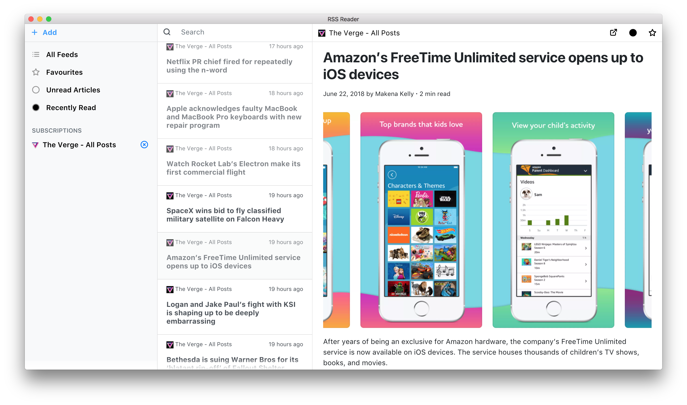

RSS Reader v2.0
==============



Simple rss reader where you can subscribe to rss feed and read it later offline. For previous version please refer [legacy branch](https://github.com/mrgodhani/rss-reader/tree/legacy).
Project is based upon [Electron Boilerplate for Vuejs](https://github.com/bradstewart/electron-boilerplate-vue) by bradstewart.

*Note*: Update to new version Vue.js Vue 2.0 is on it's way and some small changes in db.

## Usage

You need to install [Atom/Electron](https://github.com/atom/electron) first, then run it as Electron app.

```
npm install   // install dependencies

npm run release   // package app, will create app in release directory.

```

## Packaging apps for Windows

If you are packaging app for Windows from non-windows operating system. Make sure you install [Wine](https://www.winehq.org/). You can also install it via [Homebrew](http://brew.sh/)

## Features

- [x] Offline reading
- [x] Subscribing to news feed
- [ ] Updated version for tagging Articles
- [ ] Browse Articles by Tags
- [x] Search Articles
- [x] Badge counters for unread articles
- [x] Marking as read/unread
- [x] Marking as favourite
- [x] Open article link in external browser
- [ ] Exporting feed in OPML format
- [x] Resizable dialog window
- [x] Updating and making it compatible to latest version of Electron

## Support / Contribution

Please feel free to give suggestion or report bug by [creating issue](https://github.com/mrgodhani/rss-reader/issues) or letting me know on twitter [@mrgodhani](https://twitter.com/mrgodhani).
